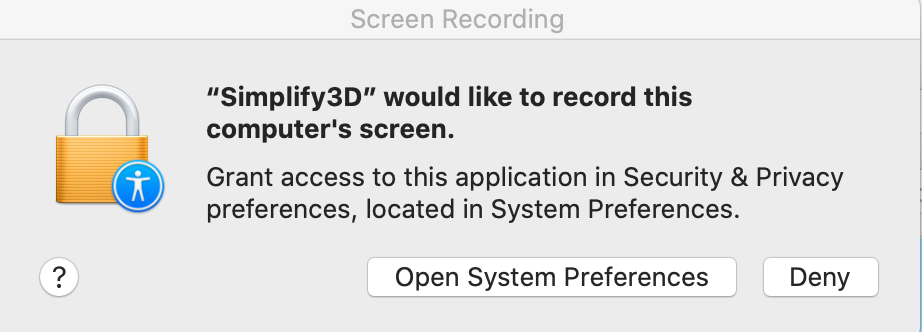
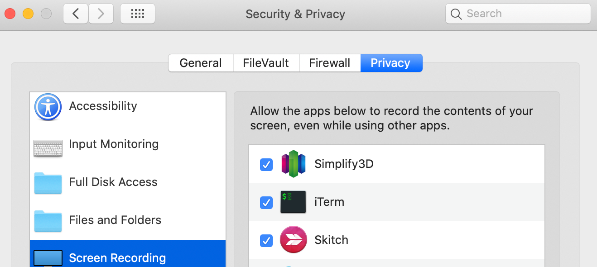

### S3D Thumbnail Generator for PrusaThumbnail plugin on OctoPrint

Linux & Mac only currently

#### Basic Setup - Linux

1. Download and place the script on your system somewhere with permissions allowing S3D to access.
   `git clone https://github.com/NotExpectedYet/s3d-thumbnail-generator.git`

2. Edit the thumbnailGeneration.bash file with your working directory. (/tmp will work fine I just left mine in my user folder).
   `WORKINGDIR="<Your full system path here>"`

3. You will need to figure out where to crop on your screen size. If your resolution is 1920x1080 then it should already work fine with the default settings. You'll have to play with these to figure out the best settings for your resolution otherwise. Update the following environment variable with your values.
  `CROPSIZE="11583x792+285+32"`

4. Make sure to install xdotools and imagemagik(usually on your OS)
   `sudo apt-get install xdotool`
   `sudo apt install imagemagick`

5. Open S3D and input the location of your script into the post-processing tab.
   

6. Slice something and await the script to run. It currently adds 2 seconds onto the slice completion time as I found the script was a little too fast at generating the thumbnail. You can change this
   `PAUSE="2"`

7. Upload to your OctoPrint instance that has the PrusaThumbnail plugin installed.
   `https://plugins.octoprint.org/plugins/prusaslicerthumbnails/`

8. Profit!
   

##### Notes: I feel this works ok, although I'd rather generate the thumbnail with OpenSCAD currently S3D stops that due to having no [input_filename] variable like it does for the [output_filename]. I have noticed however some benefits to having the gcode preview displayed rather than the actual model. For one, I know where my supports were but that will be user dependant and I do agree it would be nicer with a clean thumbnail similar to prusa/cura

#### Basic Setup - Mac

1. Download and place the script on your system somewhere with permissions allowing S3D to access.
   `git clone https://github.com/NotExpectedYet/s3d-thumbnail-generator.git`

2. Edit the thumbnailGeneration.bash file with your working directory. (/tmp will work fine I just left mine in my user folder).
   `WORKINGDIR="<Your full system path here>"`

3. (Snapshot) You will need to figure out where to crop on your screen size and update the crop enviornment variable. It is specified as X size, Y size, X Offset & Y Offset.
   `CROPSIZE_MAC="1500x1200+1100+300"`

4. (OpenSCAD) If you wish to use OpenSCAD to generate the thumbnails you will either need to specify on the command line or update the DEFAULT_THUMBMETHOD, additionally you will need to tell the script the directory to search for STL files.
   `DEFAULT_THUMBMETHOD="SCAD"`
   `STLDIR="$HOME/Work/3dprinting/Model`

5. You will need to have homebrew installed, i.e. the Mac equivalent of apt-get/yum etc. If not installed already installation details can be found here: <https://brew.sh/>

6. Install the following homebrew packages, these are required for both the snapshot and openscad method
   `$ brew install imagemagick`
   `$ brew install ghostscript`

7. For the snapshot method (which is also the fallback method for OpenSCAD) the following additional python script is needed to take the snapshot (you could do this with imagemagick, which is still used for the crop, but would also require an x11 server to be installed and started. This is a large over head for one screen shot). You can find more details about the screenshot program used on the github page <https://github.com/alexdelorenzo/screenshot.> To install do the following in a terminal window. (Install python3 and pip3 is beyond the scope of the readme, and the assumption is these are already installed)
   `$ pip3 install screenshot`

8. For the OpenSCAD method you will also required the following homebrew cask to be installed.
   `$ brew cask install openscad`

   If you try to just run 'openscad' from the command line it will give an error as it tries to start the gui. This is not an issue for the script, but if you wish to fix this the fix can be found at <https://en.wikibooks.org/wiki/OpenSCAD_User_Manual/Using_OpenSCAD_in_a_command_line_environment>

9. S3D setup is the same as in the Linux section above

10. If you use the snapshot method as primary or fall back method you will get an alert the first time it tries to take a snapshot, this will look something like
  

Click the 'Open Systems Preferences' button, and click the allow Simplify3D to do screen recordings check box.

  

#### Advanced Features

V0.2 Introduces several new features including:

* CAD style thumbnails using OpenSCAD (note limitations below)
* Search External folder for thumbnail images
* Hard code image (or stl to convert) in profile
* Fallback to snapshot when above methods fail
* Set default method in script, override per model in S3D
* Debug option to write errors and info to a file, S3D will give you no feedback if it is working or not

As mentioned above S3D does not passthrough the input file name, so if you choose to use CAD or an External folder the script has to guess the name of the STL file, it will do this by assuming the filename (without the extension) is the same for both the GCODE and the STL files, it will also require a directory to look. This means you need to be tidy with you models. If it finds the file it will process the file, if it cannot find it it will revert to taking a snapshot of the screen.

#### Advanced Usage

Place the following command in S3D as show in screenshot in Basic section, the full syntax is as follows:

    /path/thumbnailGeneration.bash [ SNAP | SCAD | EXTERNAL | FILE "filename" ]

**SNAP** [*Default*]
This is the default option as specified by DEFAULT_THUMBNAIL, therefore you do not need to specify this option un less you have changed the default. This is the original screen snapshot thumbnail method

**SCAD**
Will attempt to find STL file and then use OpenSCAD to convert it. If it fails to find the file or the OpenSCAD binaries it will fall back to SNAP mode. You can specify the OpenSCAD details in the section for your platform within the script. The directory to look for STLs is specified with the script parameter STLDIR.

**EXTERNAL**
Will search the specified directory for an image and will use that image if found. This method does not require installation of ImageMagick or OpenSCAD. But would require you to work out some method to create the images and then update the script with the relevant path. The parameter to update is PNGDIR, by default this points to STLDIR. Will fall back to SNAP if there is an issue.

**FILE**
This method allows you to pass a file directly from S3D. If the file is an STL the script will try to convert with OpenSCAD (like the SCAD option), if it is a PNG it will just copy it (like the EXTERNAL option)

There are place holders in the script for Windows Platform, and option to convert GCODE to a PNG, but none of these are implemented.
