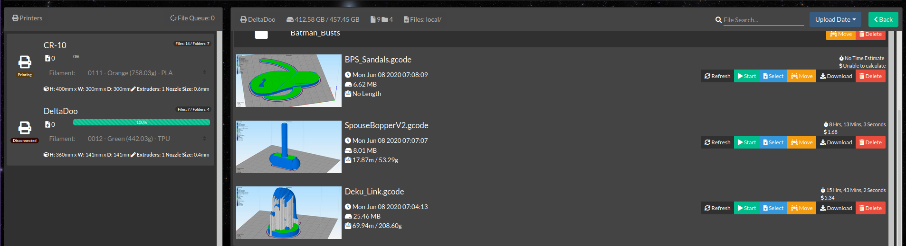

### S3D Thumbnail Generator for PrusaThumbnail plugin on OctoPrint.

#### Linux only currently

1. Download and place the script on your system somewhere with permissions allowing S3D to access.
   `git clone https://github.com/NotExpectedYet/s3d-thumbnail-generator.git`

2. Edit the thumbnailGeneration.bash file with your working directory. (/tmp will work fine I just left mine in my user folder).
   `WORKINGDIR="<Your full system path here>"`

3. Make sure to install xdotools and imagemagik(usually on your OS)
   `sudo apt-get install xdotool`
   `sudo apt install imagemagick`

4. Open S3D and input the location of your script into the post-processing tab.
   

5. Slice something and await the script to run. It currently adds 2 seconds onto the slice completion time as I found the script was a little too fast at generating the thumbnail. You can change this
   `PAUSE="2"`

6. Upload to your OctoPrint instance that has the PrusaThumbnail plugin installed.
   `https://plugins.octoprint.org/plugins/prusaslicerthumbnails/`

7. Profit!
   

#### Notes: I want to make this better once I figure out cropping. I've also tried piping the STL to openSCAD as that would generate a much better thumbnail but currently S3D doesn't output the file path for the STL, only the gcode so unless there is something out there that generates an thumbnail from gcode the screenshot is the best way currently. I've come to like it because I can see all my supports on it but yeah, happy to accept PR's for anyone willing to make this better.
